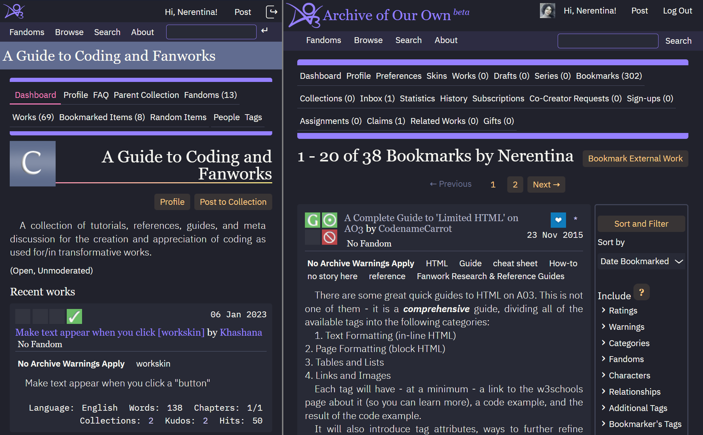

# Dracula for Archive Of Our Own

> Dark theme with flat elements for [AO3](https://archiveofourown.org)

## Install (core)
To use the built-in skins functionality, you'll need your own account.
1. Go to your `Dashboard`, then `Skins`.
2. Click `Create Site Skin`
    - Do not change `Type` - should be `Site Skin`.
    - Give skin a title, for example `Dracula for AO3 - [your username]`, because it should be unique within the site.
    - Copy and paste the contents of the file [`ao3ready_core.css`](./ao3ready_core.css) into the CSS field.
    - Click `Submit`.
3. Now you will be redirected to the page of the created skin. Click `Use` at the bottom and you're all set for now.

### Instal (mobile)
This part is covering some available on AO3 media queries. More precisely, just two of them :) 
1. Create Site skin, give a title, for example `Dracula for AO3 max 42 - [your username]` - should still be unique within the site.
2. Copy and paste the contents of the file [`ao3ready_max42.css`](./ao3ready_max42.css) into the CSS field.
3. Click on `Advanced Show ↓`
4. In the Conditions group scroll down `Media` and choose `only screen and (max-width: 42em)`. Optional - check `Parent Only`. Then click `Submit`.

6. Optional - mostly for tablets. Create new site skin in the same way as described above, but use the contents of the [`ao3ready_max62.css`](./ao3ready_max62.css) and choose `only screen and (max-width: 62em)`.

7. Combine **all your skins**.
    - Create new site skin with a title, for example, `Dracula for AO3 combined - [your username]`.
    - Scroll all the way down to Advanced, click `Show ↓`
    - In the `Parent Skins` group, click `Add parent skin`, type in the field title of the skin you created first, then click `Add parent skin` again and add second and (optionally) third skin.
    
    As you see on the screenshot above, you could add even more skins.
    - Click `Submit` and then `Use` after redirect.

## Related
This skin would never come to existence without the following awesome projects.
1. [The Organization for Transformative Works (OTW) - Archive Of Our Own (AO3) Project](https://github.com/otwcode/otwarchive)
2. [Dracula UI](https://ui.draculatheme.com)

## License
[GNU GENERAL PUBLIC LICENSE](./COPYING)